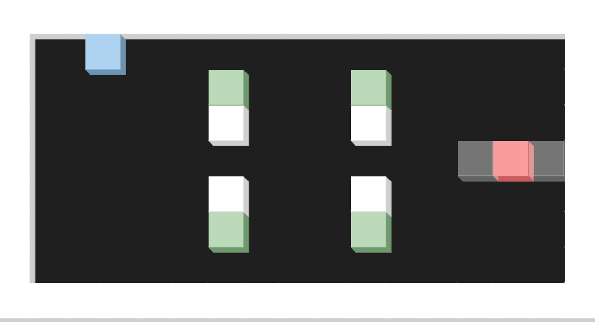

# [Project Cube Collection](https://wiryls.github.io/ProjectCubeCollection/)

A simple HTML5 puzzle game (still work in progress) based on [Egret](https://www.egret.com/).

## Tutorial

Try to move cubes to all target points, and then press `enter` to next level!

Use:

- `Arrow Keys` to move,
- `Enter` next level,
- `R` as restart,
- `N` to skip,
- `ESC` to exit.

## Rules

- Players can only control blue cubes.
- Move cubes to end points to enter next level.
- Cubes with higher priority will absorb lower. (Priority: Red > Blue > Green)
- Cubes with same priority need to hit to be merged.

## Known issues

- Frame rate becomes weird on `Chrome beta (> 72.0)` or later. Not sure if it's a bug of the browser or engine.
