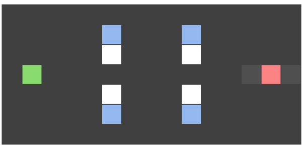

# [Project Cube Collection](https://wiryls.github.io/cube-collection/)

[English](./README.md) | [中文](./README_zh-CN.md)

A dead simple puzzle game based on [Bevy Engine](https://github.com/bevyengine/bevy), move cubes to **cover all targets** as shown in the picture below.



Try the **online version** at my [GitHub Pages](https://wiryls.github.io/cube-collection/)!

## How to Play

### Control

- Move: `Arrow Keys` or `W`/`A`/`S`/`D`.
- Restart: `R`.
- Skip current level: `N`.
- Return to the previous level: `L`.
- Reset the game: `ESC`.
- Reload the game: `Shift` + `ESC`.

### Rules

- You move ALL green cubes.
- Make cubes cover all target points to enter the next level.
- Cubes may absorb each other.
  - Red + Green -> **Red**
  - Green + Blue -> **Green**
  - Blue + Red -> **Blue**
  - Red + Green + Blue -> nothing happens
- Cubes with the same kind (except white) merge when hitting each other.

## About this repository

### Run

1. Make sure you have [Rust](https://www.rust-lang.org/tools/install) installed (edition 2021+).
2. Clone this repository: `git clone https://github.com/wiryls/cube-collection.git`
3. Compile and run: `cargo run --release -p cube-collection`

### Add custom levels

Levels are represented by TOML files. e.g.

```toml
[map]
raw = '''
                 
                 
  GGGGGGGGGGGGG  
  G   GG GG   G  
  G           G  
  G   R   R   G  
  G           G  
  G           G  
  G     x     G  
  G           G  
  W------------  
                 '''

[info]
author = "w"
title = "Haircut"
```

- `map.raw` is an ASCII drawing containing the following characters:
  - cube (place a cube here):
    - `W`: a white cube.
    - `R`: a red cube.
    - `G`: a green cube.
    - `B`: a blue cube.
  - link (place a cube and link it to):
    - `|`: the upper cube.
    - `-`: the left cube.
    - `/`: both the upper and left cubes.
  - other:
    - ` `: nothing here.
    - `x`: target point.
- `info` contains some metadata.

> Note: if any level file is invalid, game will stop loading and log the error.

If you want to add custom levels:

1. Create a TOML file like the one above.
2. Add your custom level files into `./cube-collection/assets/level/`.
3. Add file name into `name_list` of `./cube-collection/assets/level/index.toml`.

## License

This repository uses two licenses:

- `./cube-core` is under **LGPL 3.0**, and
- `./cube-collection` uses **MIT** license.

## Known issues

- Color pattern may not friendly to some color blindness.
